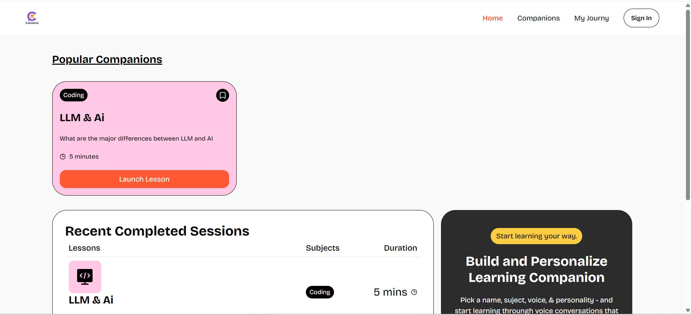
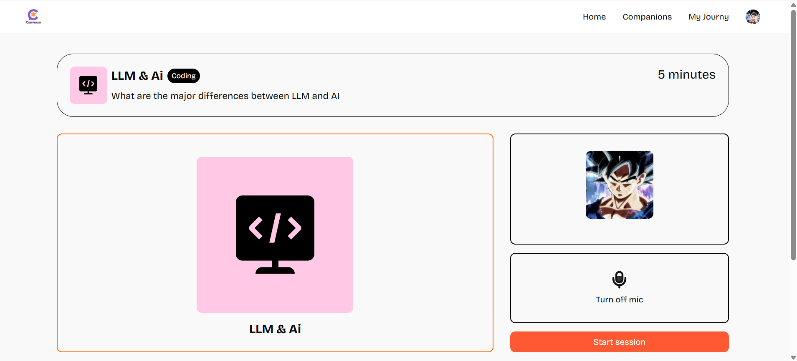

# 🧠 SaaS Voice Tutor App

🎯 Create AI-powered voice-based tutoring sessions with secure authentication, subscriptions, and modern UI using **Next.js**, **Supabase**, **Vapi**, and **Clerk**.

---

## 📚 Table of Contents

- [🤖 Introduction](#-introduction)
- [⚙️ Tech Stack](#-tech-stack)
- [🔋 Features](#-features)
- [🚀 Getting Started](#-getting-started)
- [🔗 Assets](#-assets)
- [🌄 Screenshots](#-screenshots)
- [🧪 Live Demo](#-live-demo)
- [📌 License](#-license)
- [👤 Author](#-author)

---

## 🤖 Introduction

This is a real-time AI SaaS LMS platform where users can interact with **voice-based AI tutors**, bookmark sessions, and manage subscriptions securely. It features authentication via Clerk, real-time storage with Supabase, and low-latency voice interactions using Vapi.

> ⚠️ This project was built as part of my learning journey using documentation and open-source tutorials such as the JavaScript Mastery YouTube course. Customizations were added for deeper understanding and feature expansion.

---

## ⚙️ Tech Stack

| Area        | Technology Used                                                                 |
|-------------|----------------------------------------------------------------------------------|
| Frontend    | Next.js 14, React, Tailwind CSS, Shadcn UI                                       |
| Backend     | Supabase (PostgreSQL, Auth, Realtime), Clerk (Auth)                              |
| AI & Voice  | Vapi (Voice AI), GPT-based LLMs                                                  |
| Dev Tools   | TypeScript, Zod, Vercel, GitHub, .env configs (Sentry optional)                  |

---

## 🔋 Features

- 🎤 **AI Voice Agents** – Talk to your tutor using Vapi (voice AI)
- 🔐 **Authentication** – Secure login with Clerk (supports Google login)
- 💳 **Billing & Plans** – Clerk subscription-based access
- 📌 **Bookmarks** – Save your favorite tutors or sessions
- 🎯 **Create Your Tutor** – Customize subject, topic, and conversation style
- 📱 **Responsive UI** – Works seamlessly on all screen sizes
- 🛠 **Modular Code** – Reusable, clean component-based architecture
- 🔍 **Search & Filter** – Find tutors by name or topic quickly

---

## 🚀 Getting Started

### ✅ Prerequisites

- Node.js and npm
- Git
- Accounts for **Supabase**, **Clerk**, **Vapi** (optional: Stripe, Sentry)

### 📦 Installation

```bash
git clone https://github.com/Chakrikeerthi9/sass-app.git
cd sass-app
npm install
```

### ⚙️ Environment Setup

Create a `.env` file in the root and add the following:

```env
# Clerk
NEXT_PUBLIC_CLERK_PUBLISHABLE_KEY=
CLERK_SECRET_KEY=

# Supabase
NEXT_PUBLIC_SUPABASE_URL=
NEXT_PUBLIC_SUPABASE_ANON_KEY=

# Vapi
NEXT_PUBLIC_VAPI_WEB_TOKEN=
```

> Replace the placeholder values with your actual API keys from Clerk, Supabase, and Vapi.

### 🏃 Run the App

```bash
npm run dev
```

Then open [http://localhost:3000](http://localhost:3000) in your browser.

---

## 🔗 Assets

All icons, banners, and illustrations were either:

- Sourced from the **JavaScript Mastery** video kit
- Designed using **Lucide Icons** or custom SVGs

**UI is styled with:**

- Tailwind CSS  
- shadcn/ui for modern pre-built components

**Voice AI powered by:**

- Vapi for TTS/STT  
- GPT-based LLM responses

---

---

## 🖼️ Screenshots

### 🎯 Home Page


### 🧑‍🏫 Tutor Creation


### 🗣️ Voice Chat Interface



## 🧪 Live Demo

👉 [**Live Site**](https://sass-app-indol.vercel.app/)

---

## 📌 License

This project is for **educational and demonstration purposes only**.  
You're free to fork and adapt with proper credit to referenced tutorials and contributors.

---

## 👤 Author

**Keerthi Chakri** – Full Stack AI Engineer  
[LinkedIn](https://www.linkedin.com/in/chakri-keerthi-66246633b) • [GitHub](https://github.com/Chakrikeerthi9) • *Portfolio Coming Soon*

---

⬆️ [Back to Top](#-saas-voice-tutor-app)
